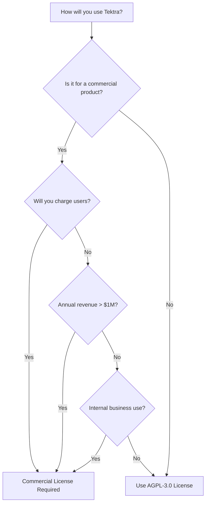

# Tektra AI Assistant Licensing Guide

## Overview

Tektra AI Assistant is dual-licensed to support both open-source development and commercial use cases:

1. **GNU Affero General Public License v3.0 (AGPL-3.0)** - For open source projects
2. **Commercial License** - For proprietary/commercial applications

This guide helps you choose the appropriate license for your use case.

## Quick Decision Guide

## License Comparison

| Feature | AGPL-3.0 | Commercial License |
|---------|----------|-------------------|
| **Cost** | Free | $50-2000+/month |
| **Source Code Disclosure** | Required | Not required |
| **Modification Rights** | Yes (must share) | Yes (keep private) |
| **Commercial Use** | Yes (with restrictions) | Yes (unrestricted) |
| **Network Use Provision** | Must provide source | No obligation |
| **Support** | Community only | Professional support |
| **Warranty** | None | Limited warranty |
| **Redistribution** | AGPL-3.0 only | Flexible terms |

## When You Need a Commercial License

A commercial license is **required** if:

### 1. Commercial Organizations
- Your organization has annual revenue exceeding $1 million
- You're using the software for internal business operations
- You're a for-profit company (regardless of whether you charge for the software)

### 2. Paid Services/Products
- You charge users for access to your service
- You offer the software as part of a paid product
- You provide consulting services using the software

### 3. Proprietary Applications
- You want to keep your modifications private
- You cannot comply with AGPL-3.0 source disclosure requirements
- You need to embed Tektra in proprietary software

### 4. Government/Public Sector
- Government agencies (except educational/research institutions)
- Public sector organizations with commercial operations
- Military or defense applications

## When AGPL-3.0 is Appropriate

You can use the AGPL-3.0 license if:

### 1. Open Source Projects
- Your project is also licensed under AGPL-3.0 or compatible license
- You're willing to share all source code modifications
- You comply with all AGPL-3.0 requirements

### 2. Non-Commercial Use
- Personal projects
- Academic research
- Educational institutions
- Non-profit organizations (with <$1M budget)

### 3. Development and Testing
- Internal development and testing
- Proof of concept projects
- Evaluation purposes (limited time)

## Commercial License Benefits

### 1. Legal Benefits
- ✅ No source code disclosure required
- ✅ Keep modifications proprietary
- ✅ Flexibility in licensing your own products
- ✅ Indemnification coverage

### 2. Technical Benefits
- ✅ Priority bug fixes
- ✅ Direct support channel
- ✅ Early access to new features
- ✅ Custom feature requests considered

### 3. Business Benefits
- ✅ SLA guarantees (Enterprise tier)
- ✅ Dedicated account management
- ✅ Training and onboarding support
- ✅ White-label options (OEM tier)

## Compliance Requirements

### AGPL-3.0 Compliance
If using the AGPL-3.0 license, you must:
1. Provide source code to all users (including network users)
2. Include copyright notices and license text
3. Document all modifications
4. Distribute under AGPL-3.0 terms
5. Provide installation instructions

### Commercial License Compliance
With a commercial license, you must:
1. Pay license fees on time
2. Respect user limits (SMB tier)
3. Not sublicense the software separately
4. Maintain confidentiality
5. Use software legally and ethically

## Frequently Asked Questions

### Q: Can I start with AGPL-3.0 and switch to commercial later?
**A:** Yes, you can upgrade to a commercial license at any time. Contact saorsalabs@gmail.com for migration assistance.

### Q: What if I'm a startup with <$1M revenue?
**A:** Startups under $1M annual revenue may qualify for special pricing. Contact us to discuss startup licensing options.

### Q: Can I use Tektra in a SaaS product?
**A:** Yes, but you need a commercial license if you charge for the service or have >$1M annual revenue.

### Q: What about consulting companies?
**A:** If you use Tektra to provide paid AI consulting services, you need a commercial license.

### Q: Are there discounts for educational institutions?
**A:** Yes, accredited educational institutions may qualify for free or discounted commercial licenses.

## License Selection Process

1. **Evaluate Your Use Case**
   - Review the criteria above
   - Consider current and future needs
   - Assess compliance capabilities

2. **Choose Your License**
   - AGPL-3.0: For open source and qualifying non-commercial use
   - Commercial: For proprietary, commercial, or enterprise use

3. **For Commercial Licenses**
   - Contact saorsalabs@gmail.com
   - Provide organization details and use case
   - Select appropriate tier (SMB, Enterprise, or OEM)
   - Complete license agreement

4. **Implementation**
   - Update your project's license notices
   - Ensure compliance with chosen license
   - Configure any license-specific features

## Contact Information

### Commercial Licensing
- **Email**: saorsalabs@gmail.com
- **Contact**: saorsalabs@gmail.com
- **Response Time**: 1-2 business days

### Legal Questions
- **Email**: legal@saorsalabs.com
- **For urgent matters**: Include "URGENT" in subject line

### Technical Support
- **AGPL Users**: GitHub issues and community forums
- **Commercial Users**: Dedicated support channels provided upon licensing

## License Compatibility

### Compatible with AGPL-3.0
- GPL-3.0
- LGPL-3.0
- Apache-2.0 (one-way compatibility)
- MIT/BSD (one-way compatibility)

### Incompatible with AGPL-3.0
- Proprietary licenses
- GPL-2.0 (without "or later" clause)
- Custom licenses with additional restrictions

## Enforcement Policy

We actively monitor for license compliance and will:
1. Contact organizations we believe require commercial licenses
2. Provide 30-day grace period for compliance
3. Offer migration assistance and fair pricing
4. Take legal action only as a last resort

Our goal is to ensure sustainable development of Tektra while supporting both open-source and commercial users.

## Updates to Licensing

- License terms may be updated with new versions
- Existing licensees maintain their current terms
- Major changes announced 90 days in advance
- Subscribe to licensing updates at saorsalabs@gmail.com

---

*Last updated: [Current Date]*
*Version: 1.0*

For any questions not covered here, please contact saorsalabs@gmail.com.